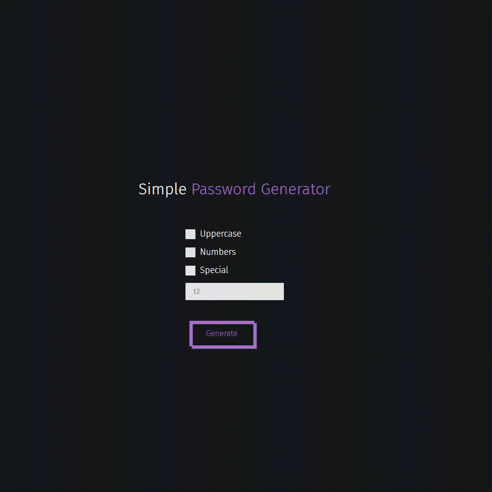

# Django Password Generator
## This site is very primitive, published to build my progress tree.



To run the site on your machine you need to install Django in this directory.
```cmd
cd folder_path
python 3 -m venv venv
.\venv\Scripts\Activate
pip install Django
python manage.py runserver
```
